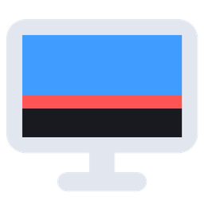

<p align="center"></p>

<h1 align="center">Trimbar</h1>

<p align="center">Hide the dead rows at the bottom of a dying monitor.</p>

Some cheap panels start failing at the bottom edge: a band of rows goes dark, smeared or garbled, and the taskbar, window edges and the bottom of maximized windows disappear into it. GPU drivers let you make a smaller custom resolution, but they always center it, so the dead rows stay in use.

Trimbar is a tiny Windows tray app that reserves a strip at the bottom of any monitor, the same way the taskbar reserves its space. Maximized, snapped and fullscreen windows stop above it, so nothing you need ends up in the broken part of the screen. Each monitor gets its own height.

## Setup

1. Download `trimbar.exe` from [Releases](https://github.com/Nicsilver/trimbar/releases) and put it somewhere permanent (for example `%LOCALAPPDATA%\Programs\Trimbar`).
2. Run it. A setup panel opens on every monitor.
3. On a broken monitor, raise the value (arrow keys, scroll wheel or the buttons) until a red bar shows up at the bottom of the screen.
4. Lower it until the red is just gone. Everything the red bar covers is now hidden from windows.
5. Press **Save**.

Monitors left at **Off** are untouched. Click the tray icon any time to adjust again, or launch the exe a second time.

## Details

- Starts with Windows by default. Toggle it in the tray menu (right-click).
- Settings live in `%APPDATA%\Trimbar\config.txt`, keyed by the monitor's device path, so they survive display renumbering and still tell two identical monitors apart.
- Handles monitors being plugged in or out, resolution changes and Explorer restarts.
- Fullscreen windows (browser video, players, borderless games) ignore the reserved space, so Trimbar shrinks any window that exactly covers a trimmed monitor to end above the strip. Apps that keep snapping back, like exclusive-fullscreen games, are left alone after a few tries. Toggle it in the tray menu.
- If the Windows taskbar is shown on a trimmed monitor, it may end up above or below the strip. Turn off "Show my taskbar on all displays" for the cleanest result.
- About 200 KB, no dependencies, around 10 MB of RAM, no CPU while idle.

The exe isn't code-signed, so SmartScreen may warn on first run ("More info" then "Run anyway").

## Building

```
cargo build --release
```

The icon is generated by `python tools/make_icon.py` (needs Pillow).

## License

MIT
